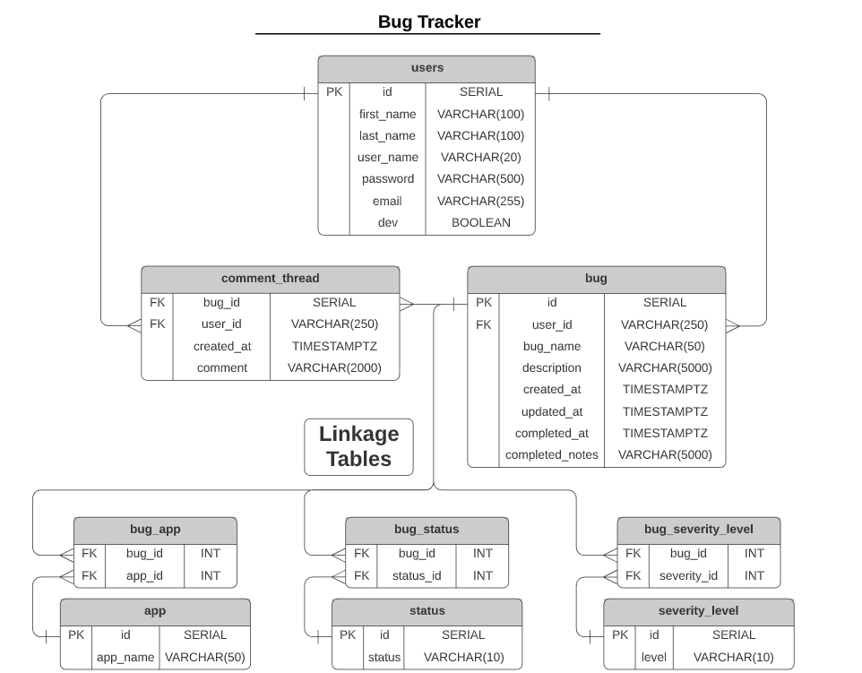

<!--
*** I'm using markdown "reference style" links for readability.
*** https://www.markdownguide.org/basic-syntax/#reference-style-links
-->

<!-- ! highlight and 'ctrl+shift+L' to replace all ! -->

<!-- thinkful-ei-rabbit -->
<!-- Cap3_Server_Team_A -->
<!-- theSwattr -->
<!-- React, Node.js, Postgresql -->
<!-- https://the-swattr.herokuapp.com/api -->

<!-- ! highlight and 'ctrl+shift+L' to replace all ! -->

[![Contributors][contributors-shield]][contributors-url]
[![Forks][forks-shield]][forks-url]
[![Stargazers][stars-shield]][stars-url]
[![Issues][issues-shield]][issues-url]
[![MIT License][license-shield]][license-url]
[![LinkedIn][linkedin-shield]][linkedin-url]

<!-- PROJECT LOGO -->
<br />
<p align="center">
  <a href="https://github.com/thinkful-ei-rabbit/Cap3_Server_Team_A">
    
  </a>

  <h3 align="center">theSwattr - Server</h3>

  <p align="center">
    React, Node.js, Postgresql
    <br />
    <a href="https://github.com/thinkful-ei-rabbit/Cap3_Server_Team_A"><strong>Explore the docs »</strong></a>
    <br />
    <br />
    <a href="https://github.com/thinkful-ei-rabbit/Cap3_Server_Team_A/issues">Report Bug</a>
    ·
    <a href="https://github.com/thinkful-ei-rabbit/Cap3_Server_Team_A/issues">Request Feature?</a>
  </p>
</p>

---

<h1 align="center">theSwattr</h1>

> ---
>
>
> _If you'd like to test the server, visit the client app..._
> <div><a href="https://github.com/thinkful-ei-rabbit/Cap3_Client_Team_A">here</a></div>
>
> ---

---

###### This README will systematically go over the entire app from the top level to the bottom layer, so I'll provide links to various sections for convenience.

# TODO - ADD DIRECTORY LINKS!

---

<!-- ? For Typescript only!
# Typescript:

## tsconfig.json:

Not much to it here - I opted for '`strict`' mode and '`ESNext`', though I need to compile to '`CommonJS`' since the tests are still in JS.

I wanted to utilize path aliases, but realized that when compiled the imports aren't updating, so for now I opted for avoiding referencing the `src/` folder in any local imports.

## jsonwebtoken.d.js:

I needed to re-declare the module here for this specific bit of code (line 187):

```js
type VerifiedObject = { sub: string };

export function verify(
  token: string,
  secretOrPublicKey: Secret,
  options?: VerifyOptions
): VerifiedObject;
```

Initially, the verify function had this type of return: `verify(): object | string` ...this didn't play nice when I needed the 'sub' key from it's return value:

```js
/* auth.js (line 66) */
const user = await CRUDService.getBySearch(req.app.get('db'), 'users', payload.sub);
```

Besides that, the module remains unchanged...

## express.d.js:

As a whole, I prefer writing namespaces for typing, and it so happens this is the preferred method (according to the docs, anyways) to customize the Express Request/Response interfaces.

I'd generally have a 'Types' namespace/file for app-specific types, but because all my custom types are only loaded into the Express namespace, I left them all under the same file.

The difference between the simlar naming conventions would be the something like `type NewUser` is applied to objects created from the `req.body`, while `type User` is created by pulling data from the database.

> _The `id` looks odd because it's only ever used in testing_

The only notable exception to the above ruls would be the custom Error type:

```js
type ErrorName = 'ValidationError' | 'UniqueViolationError';

type ExtError = {
  name: ErrorName;
  status: number;
  message: string;
  stack: string;
  errors: string;
};
```

...needed for my custom error handler:

```js
/* error-handlers.js */
const errorTypes = {
  ValidationError: 422,
  UniqueViolationError: 409
};

const errorMessages = {
  ValidationError: 'Invalid request',
  UniqueViolationError: 'Already exists.'
};
...
const errorHandler: ErrorRequestHandler = (error: Express.ExtError, _req, res, _next) =>
```

--- -->

# db:

## migrations, seeds

Nothing much to say here, simple SQL code to seed the database. However, there are some custom SQL functions in the last few migrations:

### Migration 10 - Functions

These are primarily for easily updating linkage tables via user functions. Nothing too complex, just simple `IF` and `CASE` blocks for some validation, then automated updates to tables.

The third function `init_app_severity()` is for the initial bug creation process, and acts as a one-time helper to call the other linkage-update functions.

### Migration 11 - Triggers

These are used for controlling the `updated_at` column for bugs, and for controlling the current status for a bug. Essentially, any time a comment or update on a bug is performed, a trigger will `UPDATE` the `updated_at` of that particular bug.

On initial bug creation, another trigger will fire and update the status linkage table, assigning a 'pending' default status. Additionally, a similar trigger will run on any comment table update and, if the status is not already 'open', will assign the bug so. There's also a guard against updating a 'closed' bug.

---

# src:

### server.js:

Bog-standard setup using Knex

### config.js:

I use this to configure all environment variables and export them from a single source. You can then access these via destructured imports:

```js
const { NODE_ENV } = require('./config');
```

### app.js:

Most of the setupp here is standard, with some particular use of conditionals and environment variables to configure middleware options. Note the absence of importing `express`, I'll get to that a little later...

### Barrels...

You may have already noticed that there are actually many **[ index.js ]** files peppered throughout the app. These are known as "barrel" exports, and have a few advantages when dealing with a complex file-directory. The index file in the [ routes ] folder has a short explanation, but I'll also put it here:

```js
/*
|--------------------------------------------------------------------------
| BARREL EXPORT FILE
|--------------------------------------------------------------------------
| How-To barrel-export components:
| const thingsRouter = require('./things/thingsRouter')
|
| module.exports = {
|   thingsRouter
| }
|
| Why? Readability:
| const { thingsRouter, stuffRouter, userRouter } = require('./routes')
*/
const usersRouter = require('./users.router');

module.exports = {
  usersRouter,
};
```

You can see this in action in **[ app.js ]**:

```js
const {
  appRouter,
  bugRouter,
  commentRouter,
  editBugsRouter,
  sortBugsRouter,
  usersRouter,
} = require('./routes');
```

> _Note that the import doesn't point to the index file. Node perceives **[ index.js ]** files as points of entry and the default file to grab exports from, essentially making it an implicit file in import statements_

---

## constants:

Not strictly necessary, but this can help prevent typos, along with making changes to the database less tedious to update throughout the app.

---

## libs:

A simple Winston logger, though bacause Heroku doesn't support writing logs in this way so the transports aren't created during production.

---

## middlewares:

#### express-methods.js:

Though it may be inconsequential for a server of this scale, it should be known that every time you import a package from `node_modules` there's a memory cost at runtime, made worse by doing a destructured import. Express is costly to import (~750K unzipped), so I came up with this method here, resulting in importing Express only once in my entire server.

I can create both the `app` and `jsonBodyParser` (which is just middleware), and extract the `Router()` method itself (to be used as a sort of local "helper" function). Beacuase these are now local dependencies, I can import these wherever I want without an impact on runtime performance.

-Derek Nellis

#### body-validators.js:

These are used to extract and validate request body values on a per-route basis, serialize any user-inputs, then creates a completed object passing it on to the next middleware. There are a few helper-functions at the top to DRY up the code a bit.

#### auth.js, error-handlers.js:

There's nothing too special here, just basic Token authentication, password encryption, and error handling/formatting.

---

## routes:

### main endpoint:

```
  'https://the-swattr-api.herokuapp.com'
```

#### bug: `/api/bugs`

```
  '/'                 -  GET, POST (all bugs)
  '/:id'              -  GET (bug by id)
  '/user/:userName'   -  GET (bugs by user)
  '/app/:app'         -  GET (bugs by app)
  '/status/:status'   -  GET (bugs by status)
  '/severity/:level'  -  GET (bugs by severity)
```

#### app: `/api/app`

```
  '/'          -  GET (gets all app names)
  '/severity'  -  GET (gets all severity names)
  '/status'    -  GET (gets all status names)
```

#### users: `/api/users`

```
  '/'               -  GET (gets all users)
  '/token'          -  GET (for auth token refreshing)
  '/login'          -  POST (posts login)
  '/register'       -  POST (posts new user)
  '/dev'            -  PATCH (toggles dev status of self)
  '/dev/:userName'  -  PATCH (toggles dev status of user)
```

#### comment: `/api/comments`

```
  '/'                -  GET, POST (get all/post comments)
  '/:id'             -  GET, PATCH, DELETE (CRUD operations by id)
  '/bug/:bugId'      -  GET (get comments for bug)
  '/user/:userName'  -  GET (get comments posted by user)
```

#### sort-bugs: `/api/sort`

```
  [ '/status/:app', '/app', '/severity/:app' ]
  GET (returns arrays of bugs sorted by status/app/severity)
```

#### edit-bugs: `/edit`

```
  '/:bugId' - PATCH (edits a specific bug)
```

## database ERM:

<div align="center">
  <h5>A brief overview of the database:</h5>
  
</div>

---

## services:

### CRUD.service.js

Dynamic Knex Query-Builder methods for all basic CRUD operations.

### query.service.js

If anything outside of basic `SELECT` operations are needed (like table joins, grouping, etc), they're in here.

### serialize.service.js

Passes all submissions through here for sanitization, and formats raw database queries into a more javascript-friendly format.

---

## <!-- CONTACT -->

## Contact Derek:

#### Github - [musicMan1337][github]

#### LinkedIn - [Derek-8Bit-Nellis][linkedin]

#### Facebook - [Derek Nellis][facebook]

#### Instagram - [@derek.8bit.nellis][instagram]

## Contact Mark:

#### Github - [Mark-The-Dev](https://github.com/Mark-The-Dev)

#### LinkedIn - [Mark Marcello](https://www.linkedin.com/in/mark-marcello/)

## Contact Russell:

#### Github - [Russjames92](https://github.com/Russjames92)

#### LinkedIn - [Russell Champlain](https://www.linkedin.com/in/russell-champlain/)

<!-- MARKDOWN LINKS & IMAGES -->

<!-- https://www.markdownguide.org/basic-syntax/#reference-style-links -->

[contributors-shield]: https://img.shields.io/github/contributors/thinkful-ei-rabbit/Cap3_Server_Team_A.svg?style=flat-square
[contributors-url]: https://github.com/thinkful-ei-rabbit/Cap3_Server_Team_A/graphs/contributors
[forks-shield]: https://img.shields.io/github/forks/thinkful-ei-rabbit/Cap3_Server_Team_A.svg?style=flat-square
[forks-url]: https://github.com/thinkful-ei-rabbit/Cap3_Server_Team_A/network/members
[stars-shield]: https://img.shields.io/github/stars/thinkful-ei-rabbit/Cap3_Server_Team_A.svg?style=flat-square
[stars-url]: https://github.com/thinkful-ei-rabbit/Cap3_Server_Team_A/stargazers
[issues-shield]: https://img.shields.io/github/issues/thinkful-ei-rabbit/Cap3_Server_Team_A.svg?style=flat-square
[issues-url]: https://github.com/thinkful-ei-rabbit/Cap3_Server_Team_A/issues
[license-shield]: https://img.shields.io/github/license/thinkful-ei-rabbit/Cap3_Server_Team_A.svg?style=flat-square
[license-url]: https://github.com/thinkful-ei-rabbit/Cap3_Server_Team_A/blob/master/LICENSE.txt
[linkedin-shield]: https://img.shields.io/badge/-LinkedIn-black.svg?style=flat-square&logo=linkedin&colorB=555
[linkedin-url]: www.linkedin.com/in/derek-8bit-nellis
[product-screenshot]: images/p10k.png

<!-- project links -->

<!-- links to social media accounts -->

[twitter]: http://www.twitter.com/userName
[facebook]: http://www.facebook.com/derek.nellis.9
[googleplus]: https://plus.google.com/+userName
[tumblr]: http://userName.tumblr.com
[dribble]: http://dribbble.com/userName
[linkedin]: https://www.linkedin.com/in/derek-8bit-nellis/
[github]: http://www.github.com/musicMan1337
[instagram]: https://www.instagram.com/derek.8bit.nellis/?hl=en
